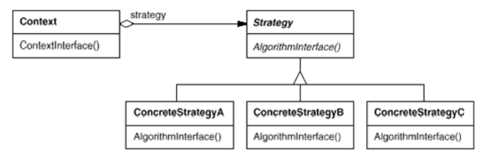

# 스트래티지 패턴

전략 패턴이라고 한다.

이 패턴은 정말 [넥스트스텝](https://edu.nextstep.camp/) 의 TDD, Clean Code with 자바 12기 에서 모든 스텝마다 썼던것 같다. 😁

게임으로 비유하자면 `공격` 이라는 행위가 있다면

공격 종류에는 칼, 총, 주먹 등이 있을 것이다.

게임만한 비유가 없는것 같다. 탈부착이 이렇게하면 당연히 쉽지 않은가?

그러니까 하나의 행위에 다양한 알고리즘이 존재하면 그것들을

하나의 클래스로 캡슐화하고 그것을 갖다 끼운다고 생각하면 된다❗

## 의도와 동기

그래서 클라이언트쪽에서 의존적이지 않게 유동적으로 바꿔줄 수 있어야 한다.

이 문제는 `if-else` 구문에서 가장 많이 사용했었다.

더불어 `switch`에서도 일단 `만약 ~라면 어떤것을 실행해라` 라는 조건이 있을때 이걸

전부 다 클래스로 분리한다고 하면 인터페이스의 구현체만 갈아 끼워주면 되는 것이다.

## 클래스 다이어그램



클래스 다이어그램은 위와 같다.

- Strategy
  - 수행해야 하는 행위를 인터페이스로 선언
- ConcreteStrategy
  - `Strategy`에 선언된 여러 기능을 구현
- Context
  - 어떤 콘크리트 클래스를 `Strategy`에 장착 시킬 것인가를 정해준다.
  - 메소드만 가져다 사용하면 된다.
  - 같은 메소드지만 안의 구현이 다르기 때문에 변경에 강하다.
    - 안바꿔주고 내부(구현체)만 바꾸면 된다라는 뜻

여기에 구현된 예제 뿐만 아니라

나는 랜덤한 값의 경우에 스트래티지를 넣은 경험이 있다.

그건 TDD 과정에서의 사다리 게임이었는데,

```java
public class RandomStrategyImpl implements RandomStrategy {

    private static final Random random = new Random();

    @Override
    public boolean createLine() {
        return getRandom();
    }

    private boolean getRandom() {
        return random.nextBoolean();
    }
}
```

```java
public interface RandomStrategy {

    boolean createLine();
}
```

```java
public class Test {

    public void make(RandomStrategy randomStrategy) {
        // 행위
    }

    public static void main(String[] args) {
        Test test = new Test();
        test.make(() -> true);
    }
}
```
한 발자국 더 나아가 지금 이 `RandomStrategy`는 함수형 인터페이스이다.

람다식으로 치환하여 경우에 따라 `() -> true/false` 로 넣어줄 수 있기 때문에

더욱 편리하게 탈부착이 가능하다.