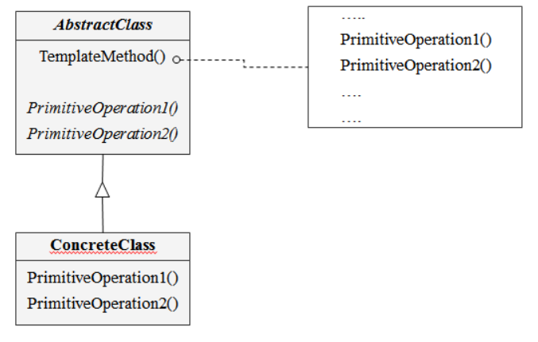

# 템플릿 메소드 패턴

상위 클래스에서는 전체적인 흐름을 구현하고 구체적인 처리는 하위 클래스에 위임

뭔가 말만 들어보면 구조상 팩토리 메소드가 떠오른다.

그래서 좀 찾아보니까 팩토리 메소드 패턴이 이 템플릿 메소드 패턴을 활용해서 만든 패턴인 것이다.

## 템플릿 메소드 패턴의 특징

- 상속을 통해 부모클래스의 기능을 확장할 때 사용
- 불변 기능은 부모클래스에 만들어두고 자주 변경되거나 확장할 기능은 자식클래스에서 구현해준다.
- 부모 클래스에는 기본 로직과 그 기능 일부를 추상 메소드나 오버라이드가 가능한 메소드로 구현한다.
- 자식 클래스는 부모 클래스에서 만든 메소드들을 입맛에 맞게 구현해준다.
- **훅 메소드**: 선택적 오버라이드가 가능하게 한 메소드

클래스 다이어그램은 아래와 같다.

디자인 패턴을 듣고 공부하면서 늘은 지식은 클래스 다이어그램을 보는 눈이 많이 길러졌다.

## 객체 협력

- AbstractClass
  - 서브 클래스들이 반드시 구현해야 하는 알고리즘 처리 단계 내의 기본 오퍼레이션이 무엇인지를 정의
  - 서브 클래스에서 이 오퍼레이션을 구현
- ConcreteClass
  - 상위 클래스에서 선언된 추상 메소드를 구현
  - 이미 구현된 메소드 오버라이드

템플릿 메소드는 코드 재사용을 위한 패턴이고

프레임워크에서 많이 사용되는 패턴중 하나라고 한다.