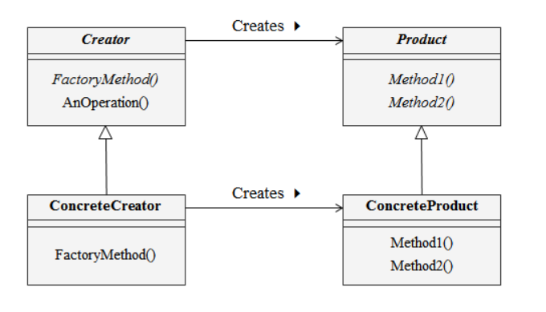

# 팩토리 메소드 패턴

인스턴스의 작성을 하위 클래스에게 위임한다.

템플릿 메소드 패턴을 인스턴스 생성부분에 적용시킨 패턴이다.

객체를 생성하기 위한 인터페이스를 정의는 하지만 인스턴스에 대한 결정은 서브클래스에서 결정한다.

여러 상황에 따라 각각 생성될 수 있는 객체의 생성을 하위 클래스에 위임한다.

그림으로 설명해보면 `Creater` 를 구현하는 구현체인 `ConcreteCreator`를 어떤 `Creater` 로 만들어줄지

구현한다. 그 후에 `Creator` 안에서 `Product`에 대한 생성 메소드만 정의해주고 이 역시

콘크리스 클래스에서 만들어주게 되어있다.

- Product
  - 팩토리 메소드가 생성하는 객체의 인터페이스를 정의
- ConcreteProduct
  - Product클래스의 구현체
- Creator
  - Product타입을 반환하는 추상메소드를 선언
  - 기본적으로 팩토리 메소드를 구현하지만, 여기서는 ConcreteProduct 반환
- ConcreteCreator
  - ConcreteProduct의 인스턴스를 반환하기 위해 팩토리 메소드 재정의