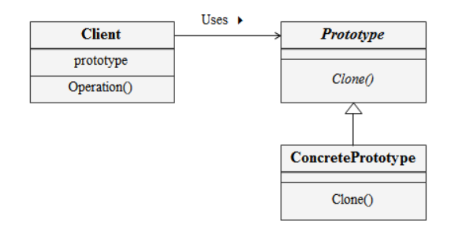

# 프로토타입

프로토 타입은 하나의 인스턴스가 나머지를 복제해서 생성해주는 패턴이다.

우리는 인스턴스를 생성할때 `new` 해서 생성하는데,

DB에서 매번 가져와서 설정해주는 때에 굉장히 복잡하게 될 것이다.

프로토 타입 패턴은 인스턴스의 생성과정이 복잡하거나 여러 조합에 의해 생성되어야 하는 경우

하나의 프로토타입을 만들어 이를 복제해서 만드는 방법이다.

`Cloneable` 을 구현받아 이 객체가 복제해도 된다 라는 것을 알려준다.

기본 `@Override` 메소드는 `super.clone()`을 갖고있다.

이 복사는 얕은 복사를 해주기 때문에 원래 가지고있던 데이터가 변경되면 같이 값이 변경된다.

그렇기 때문에 깊은복사를 해주어야 하는데 getter 메소드로 값을 받고 새로운 객체로 할당해서

새로운 `BookShelf`를 만들고 넣어준다.

이렇게 되면 값은 다 복사하되, 주소는 같은 값을 참조하지 않기 때문에 깊은 복사가 진행된다.

## 클래스 다이어그램

우리가 살펴볼 프로토타입의 클래스 다이어그램이다.

